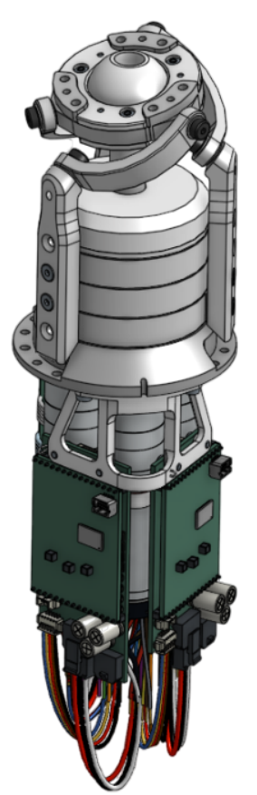

# Orbita3d control stack

[](https://github.com/pollen-robotics/orbita3d_control/actions/workflows/rust.yml)
[](https://github.com/pollen-robotics/orbita3d_control/actions/workflows/python.yml)



Control tools for Orbita 3D actuator


## Overview

This repository contains all libraries required to control an Orbita3d actuator. It allows:
* to fully control the actuator using Python
* access the full API (Rust package or C-API library)
* integrate the actuator in your ROS robot (URDF and ROS2 humble control hardware interface)

## Docs 

See the [full documentation](https://pollen-robotics.github.io/orbita3d_control/)

## Installation

In order to run this project, you need to have Rust installed on your machine. You can install it by following the instructions on the [official Rust website](https://www.rust-lang.org/tools/install).
Additionally, you will need to have the EtherCAT master installed on your machine. You can find the instructions on how to install it [here](https://pollen-robotics.github.io/orbita3d_control/installation/installation_ethercat.md).


To install the project, you can clone the repository 

```shell
git clone git@github.com:pollen-robotics/orbita3d_control.git
```

Then, you can build the project by running:

```shell
cargo build --release
```

## Usage

The package can be used in different ways:

- [Rust API](orbita3d_controller/README.md): Rust API to control the actuator  - see in [docs](https://pollen-robotics.github.io/orbita3d_control/installation/install_package)
- [Python API](orbita3d_c_api/python/README.md): Python bindings for the C-API library - see in [docs](https://pollen-robotics.github.io/orbita3d_control/installation/python)
- [C-API library](orbita3d_c_api/README.md): plain C-API library to control the actuator - see in [docs](https://pollen-robotics.github.io/orbita3d_control/installation/orbita_c)
- **ROS2 integration**: The package can be integrated in a ROS2 system using the provided humble integration package - see in [docs](https://pollen-robotics.github.io/orbita3d_control/installation/ros)

## Contents

This repository contains the following sub-packages:

### Rust packages for control

* [orbita3d_kinematics](orbita3d_kinematics/README.md): forward/inverse kinematics model (in Rust)
* [orbita3d_controller](orbita3d_controller/README.md): low-level communication (serial or ethercat) and control (in Rust)

### C-API library and Python bindings

* [orbita3d c_api](orbita3d_c_api/README.md): plain C-API library to control the actuator
* [orbita3d python bindings](orbita3d_c_api/python/README.md): Python bindings for the C-API library

### ROS2 humble integration

* [orbita3d_description](orbita3d_description/README.md): URDF/ros2_control description of the actuator
* [orbita3d_system_hwi](orbita3d_system_hwi/README.md): ros2 control hardware system interface for the actuator


## Changelog

See [changelog](https://github.com/pollen-robotics/orbita3d_control/releases).


## Support

This project adheres to the Contributor [code of conduct](CODE_OF_CONDUCT.md). By participating, you are expected to uphold this code. Please report unacceptable behavior to [contact@pollen-robotics.com](mailto:contact@pollen-robotics.com).

Visit [pollen-robotics.com](https://pollen-robotics.com) to learn more or join our [Dicord community](https://discord.gg/vnYD6GAqJR) if you have any questions or want to share your ideas.
Follow [@PollenRobotics](https://twitter.com/pollenrobotics) on Twitter for important announcements.
