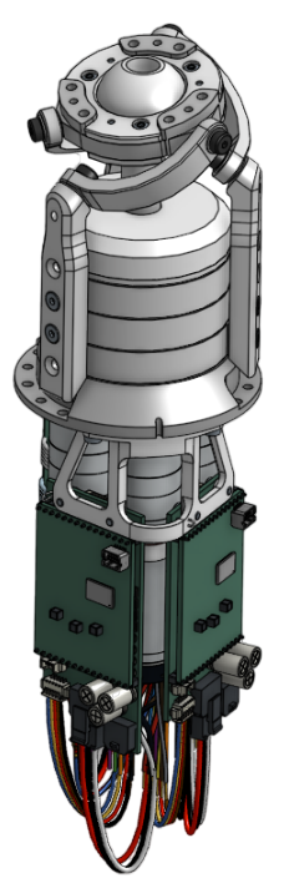

# Orbita3d control stack

## Overview

This repository contains all libraries required to control an Orbita3d actuator. It allows:

* to fully control the actuator using Python
* access the full API (Rust package or C-API library)
* integrate the actuator in your ROS robot (URDF and ROS2 humble control hardware interface)

## Installation

In order to run this project, you need to have two main prerequisites: Rust and EtherCAT master installed on your machine

- The guide to installing Rust can be found on the [official Rust website](https://www.rust-lang.org/tools/install).
- See how to install EtherCAT master IgH in our  [installation guide](installation_ethercat.md).

The orbita3d control stack can then installed in several differenet ways - see [installation](installation/install_package.md) for more details

## Usage

The package can be used in different ways as well

- [Rust API]({{config.repo_url}}/orbita3d_controller/README.md): Rust API to control the actuator  - see in [docs](installation/rust_crate)
- [Python API]({{config.repo_url}}/orbita3d_c_api/python/README.md): Python bindings for the C-API library - see in [docs](installation/python)
- [C-API library]({{config.repo_url}}/orbita3d_c_api/README.md): plain C-API library to control the actuator - see in [docs](installation/orbita_c)
- **ROS2 integration**: The package can be integrated in a ROS2 system using the provided humble integration package - see in [docs](installation/ros)

## Crate structure

This repository contains the following sub-packages:

#### Rust packages for control

* [orbita3d_kinematics]({{config.repo_url}}/orbita3d_kinematics/README.md): forward/inverse kinematics model (in Rust)
* [orbita3d_controller]({{config.repo_url}}/orbita3d_controller/README.md): low-level communication (serial or ethercat) and control (in Rust)

#### C-API library and Python bindings

* [orbita3d c_api]({{config.repo_url}}/orbita3d_c_api/README.md): plain C-API library to control the actuator
* [orbita3d python bindings]({{config.repo_url}}/orbita3d_c_api/python/README.md): Python bindings for the C-API library

#### ROS2 humble integration

* [orbita3d_description]({{config.repo_url}}/orbita3d_description/README.md): URDF/ros2_control description of the actuator
* [orbita3d_system_hwi]({{config.repo_url}}/orbita3d_system_hwi/README.md): ros2 control hardware system interface for the actuator

## Changelog

See [changelog](https://github.com/pollen-robotics/orbita3d_control/releases).

## Related repositories

### Flipsky design

* [Mechanical design](https://cad.onshape.com/documents/d108475d689e47a5561e996c/w/1d6ae1891c12354f3ac85124/e/f54fa638e232e8705b683608)
* [Electronics design](https://github.com/pollen-robotics/orbita3d_elec)
* [Firmware](https://github.com/pollen-robotics/firmware_Orbita3dofs/tree/Flipsky_FSESC6.7-pro)